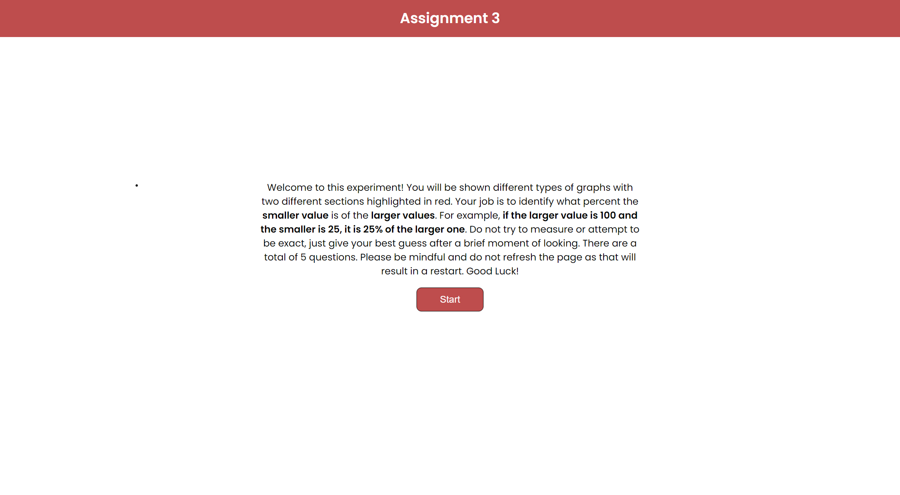
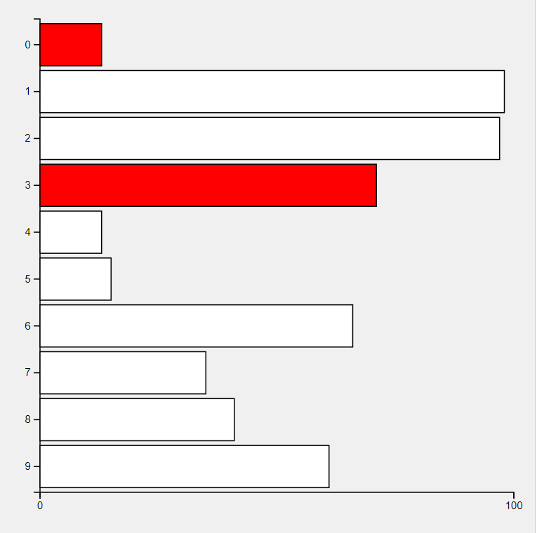
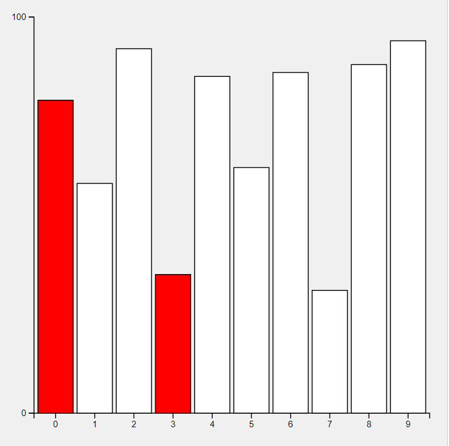
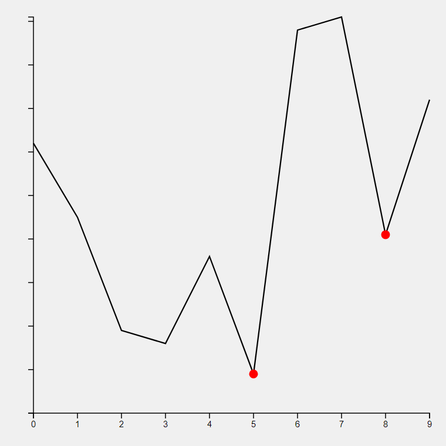
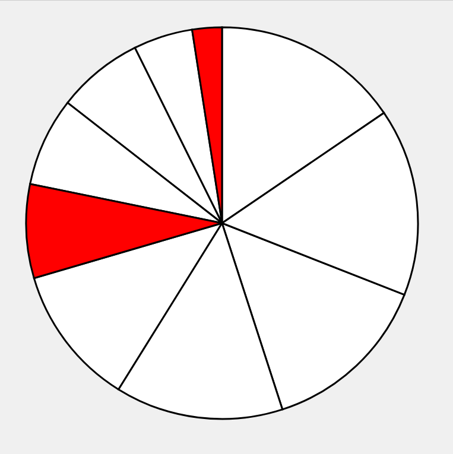
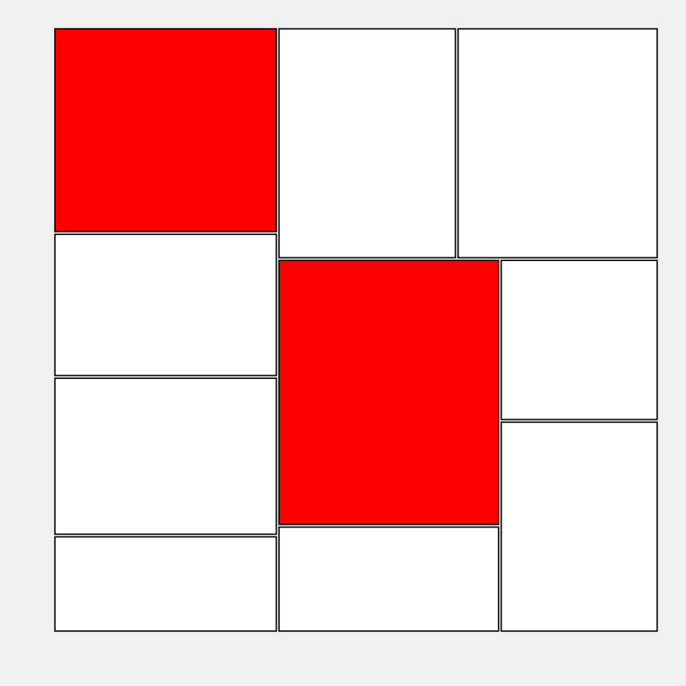
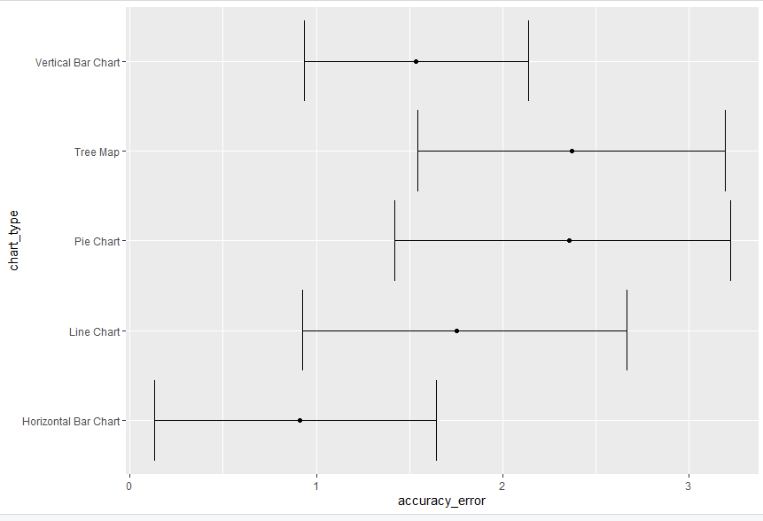
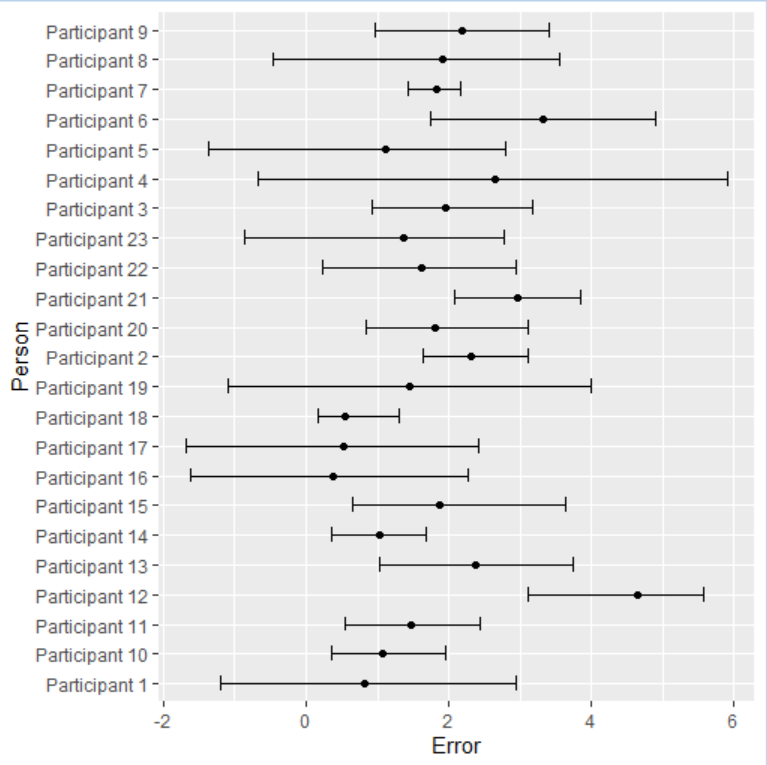

# Visualization Experiment

## Experiment Hosted Link

[Experiment Website](https://echo532.github.io/a3-Experiment/)
[Original Repo](https://github.com/lyuchil/a3-Experiment)

## Description

For assignment 3, we decided to create the experiment done by Cleveland and McGill. In place of the stacked bar chart, we decided to introduce horizontal bar chart, a line chart, and a treemap for comparison. We designed the experiment where users engage with 5 different types of charts, aiming to evaluate their perception of data visualizations. Participants are shown graphs with two points highlighted in red and asked to estimate what percent the smaller point represents of the larger one. Upon completing the quiz, participants receive their results, which they can opt to submit. This experiment was primarily developed using HTML, JavaScript, CSS, and leverages the Google Sheets API alongside Express for data collection. Though initially designed to record responses directly to Google Sheets, deployment constraints led us to adjust the functionality to display results at the quiz's end, hosted via GitHub Pages. As a result, we had to have the participants send us a screenshot of the result page. In total, we had 23 participants that reported their results. 

## Technical Difficulties 

One of the major technical difficulties we encountered was related to Github pages. After we unpublished the Github page, we weren't able to re-enable it for whatever reason. The deployment of the website just kept failing. So as a result, we forked a new repo in order to host the page. The original repo linked shows the progression of this project.

There were also some oversight in the experiment. First being that the line chart we produced had markings on the y-axis that potentially indicated the scale. This could've altered and skewed the data for line chart. On top of that, we found people were very accurate for their guesses. We weren't next to the participants to adminstered the experiment and our instructions could've been unclear. We suspect that people may have spent longer on each chart when guessing than anticipated. 

 <!-- Replace path/to/screenshot.png with the path to your screenshot -->

## Technical Achievements

- **Google Sheets API Integration**: Achieved a seamless connection with Google Sheets API using Express, enabling real-time data recording of user responses during local testing.
- **Responsive Web Design**: Implemented responsive design principles ensuring the experiment's accessibility across various devices and screen sizes.
- **Data Visualization with D3.js**: Utilized D3.js to dynamically generate randomized charts for the quiz, enhancing the interactivity and engagement of the experiment.

## Design Achievements

- **Interactive Quiz Layout**: Crafted an intuitive and engaging user interface for the experiment, guiding participants through the visualization tasks with clear instructions and instant feedback.
- **Styling with Google Fonts**: Incorporated Google Fonts to improve readability and aesthetics, contributing to a more polished and professional appearance.
- **Chart Varieties**:
  - **Horizontal Bar Chart**: Showcases comparisons among categories horizontally.  
    
  - **Vertical Bar Chart**: Facilitates understanding of category comparisons vertically.  
    
  - **Line Chart**: Illustrates trends or changes over intervals.  
    
  - **Pie Chart**: Represents data in proportions within a circular graph.  
    
  - **Tree Map**: Displays hierarchical data using nested rectangles.  
    

## Data Analysis

The collected data was analyzed to calculate the average log2Error across all visualization types and trials, further enriched with Bootstrapped 95% confidence intervals to provide a robust measure of participants' accuracy in interpreting the visualizations.

As expected and seen in results from Cleveland and McGill, bar chart had the lowest erorr compared to all the other chart types. Additionally, we found that the error for horizontal bar chart is lower than the vertical bar chart. 

We also produced an overall average error per participant. 
